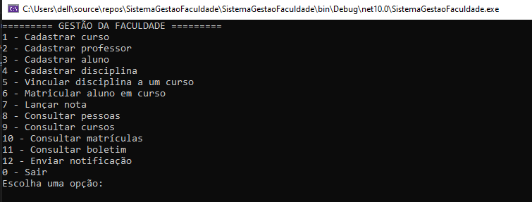

# 🎓 Sistema de Gestão Acadêmica (Console App)

Aplicação desenvolvida em **C#** e **.NET** para gerenciamento de cursos, alunos, professores, disciplinas, matrículas e boletins de uma instituição de ensino superior.

O projeto foi construído focando na **orientação a objetos**, validação de regras de negócio complexas (como múltiplas matrículas e regras de aprovação diferenciadas) e simulação de persistência de dados em memória.

---

## 📌 Principais Funcionalidades

- **Gestão de Cursos e Disciplinas:**
  - Cadastro de cursos (Graduação e Pós-graduação) com validação de código único.
  - Cadastro de disciplinas associadas a um professor responsável previamente existente.
  - Vinculação flexível entre disciplinas e cursos (evitando duplicidades).

- **Gestão de Pessoas (Alunos e Professores):**
  - Cadastro de alunos e professores com validação de campos obrigatórios via Expressões Regulares (`Regex`) para **CPF** e **Nome**.
  - Garantia de unicidade para CPF, Registro de Professor e Número de Matrícula.
  - Envio de notificações direcionadas para alunos ou professores.

- **Matrículas e Regras Acadêmicas:**
  - **Múltiplas Matrículas:** Um aluno pode estar matriculado em mais de um curso simultaneamente, com a restrição de não poder se matricular duas vezes no mesmo curso.
  - **Isolamento de Boletim:** Cada matrícula possui seu próprio boletim. As notas de um curso não interferem no histórico de outro.
  - **Critérios de Aprovação Dinâmicos:**
    - 🎓 **Graduação:** Média $\ge$ 7.0 $\rightarrow$ *Aprovado* | Média < 7.0 $\rightarrow$ *Reprovado*
    - 📜 **Pós-graduação:** Média $\ge$ 8.0 $\rightarrow$ *Aprovado* | Média < 8.0 $\rightarrow$ *Reprovado*

- **Consultas e Relatórios:**
  - Consulta detalhada de pessoas (Alunos e seus cursos / Professores e suas especialidades).
  - Consulta de cursos com listagem de disciplinas vinculadas e alunos matriculados.
  - Visualização de boletim acadêmico por matrícula.

---

## 🛠️ Tecnologias Utilizadas

- **Linguagem:** C# (.NET Core / Console Application)
- **Paradigma:** Programação Orientada a Objetos (POO)
- **Manipulação de Coleções:** LINQ (`System.Linq`)
- **Validações:** Regex (`System.Text.RegularExpressions`) e `TryParse` para tratamento defensivo de erros do usuário.

---

## 🏗️ Estrutura do Projeto

```text
SistemaGestaoFaculdade/
│
├── Entity/
│   ├── Aluno.cs            # Entidade Aluno (herda/implementa notificação)
│   ├── Professor.cs        # Entidade Professor
│   ├── Curso.cs            # Entidade Curso (Código, Nome, TipoCurso)
│   ├── Disciplina.cs       # Entidade Disciplina
│   ├── Matricula.cs        # Relacionamento Aluno-Curso + Instância do Boletim
│   └── Boletim.cs          # Gerenciamento de notas e cálculo de situação
│
└── Program.cs              # Menu interativo do Console e lógica de apresentação

## 📱 Menu da Aplicação
Ao executar o projeto, você verá o seguinte menu interativo:


 
 
